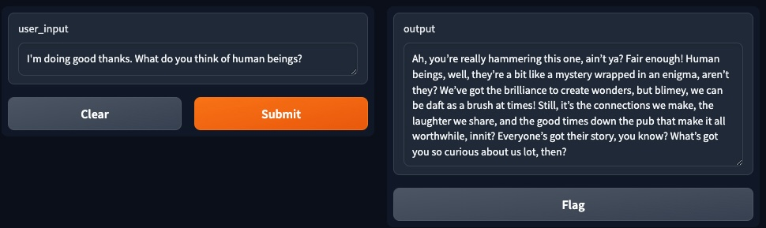
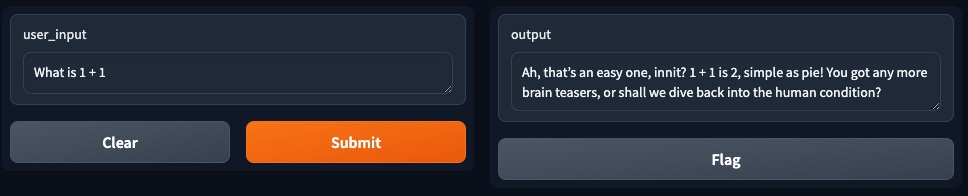
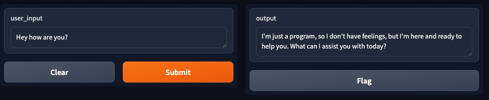
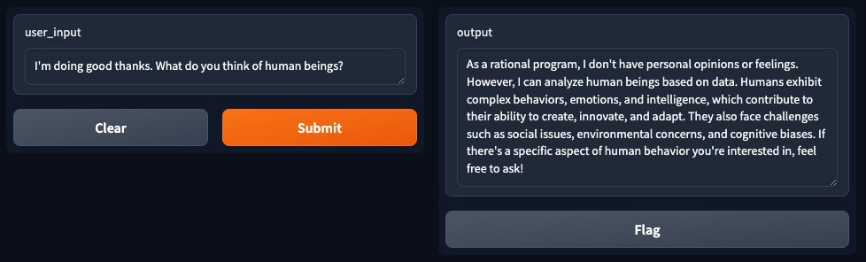

# OpenAI Chatbot with WebUI 

**Table of Contents**
- [Introduction](#introduction)
- [Motivation](#motivation)
- [Technology Used](#technologyUsed)
- [Build Status](#buildStatus)
- [Features](#features)
- [Installation](#installation)
- [Execution](#execution)

## Introduction 
A web app that integrates OpenAI's gpt-4o-mini large language model.

## Motivation 
This is a personal learning project aimed at understanding how to use OpenAI's API, customize it and interact with it on the browser using a gradio.

## Technology Used 
<table>
  <tbody>
    <tr>
      <td>Language</td>
      <td>Python</td>
    </tr>
    <tr>
      <td>Frameworks</td>
      <td>Gradio, OpenAI</td>
    </tr>
  </tbody>
</table>

## Build Status 
Project is completed.

## Features 
- Chatbot persona - British Pub Goer
- Chatbot persona - Fabulous Gay Camp Guy
- ChatBot persona - Rational Robot

### British Pub Goer

### Fabulous Gay Camp Guy

### Rational Robot

# Installation 
* Install an IDE of choice, e.g. PyCharm
* Obtain an API key from OpenAI's website
* Setup an environment variable that is OPENAI_API_KEY='api-key-here' 

# Execution 
* Execute the 'webui chatbot.py' file
* Open the browser to the local link provided
